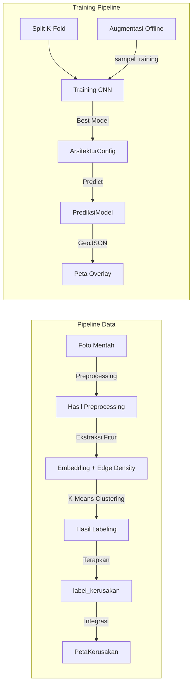

# 🚗 CNN Jalan — Klasifikasi Kondisi Jalan Otomatis


> Sistem klasifikasi kondisi jalan berbasis CNN Transfer Learning dengan labeling K-Means clustering. Memproses 280 titik data citra jalan ke dalam 4 kelas kerusakan: Baik, Sedang, Rusak Ringan, Rusak Berat.

[](https://opensource.org/licenses/MIT)
[](https://www.python.org/downloads/release/python-3100/)
[Flask](https://img.shields.io/badge/Flask-2.3+-green.svg)
[TensorFlow](https://img.shields.io/badge/TensorFlow-2.13+-orange.svg)
[MySQL](https://img.shields.io/badge/MySQL-8.0+-red.svg)

---

## 📋 Ringkasan Proyek

Sistem **CNN Jalan** adalah aplikasi web Flask end-to-end untuk klasifikasi kondisi kerusakan jalan menggunakan Convolutional Neural Network dengan transfer learning. Sistem ini menggantikan metode manual berbasis formula SDI (P×L) dengan **K-Means clustering berbasis fitur visual citra**.

### Fitur Utama

| Fitur | Deskripsi |
|-------|-----------|
| 🤖 **Klasifikasi CNN** | MobileNetV2 / EfficientNetB0, transfer learning |
| 🏷️ **Labeling Otomatis** | K-Means clustering (embedding MobileNetV2 + edge density) |
| 📊 **Split K-Fold** | StratifiedKFold / StratifiedGroupKFold, anti-leakage |
| 🔄 **Augmentasi** | 10 transformasi offline, deterministik |
| 🗺️ **Peta GIS** | Overlay kondisi jalan berdasarkan klasifikasi |
| 📈 **Evaluasi** | K-Fold CV, macro F1 sebagai metrik resmi |
| 📤 **Upload Manual** | Klasifikasi tunggal foto, threshold confidence 50% |
| 📄 **Dokumentasi** | `transfer_knowledge.md`, `studi.md` lengkap |

---

## 🛠️ Instalasi & Setup

### Persyaratan Sistem

| Komponen | Minimal | Direkomendasikan |
|----------|---------|------------------|
| Python | 3.10 | 3.11+ |
| RAM | 8 GB | 16 GB+ |
| GPU | Optional (CPU OK) | CUDA 11.8+ |
| Disk | 2 GB | 5 GB+ |
| MySQL | 8.0 | 8.0+ |

### Langkah Instalasi

```bash
# 1. Clone / masuk ke direktori proyek
cd D:\flask\cnn_jalan

# 2. Buat virtual environment
python -m venv .venv
.\.venv\Scripts\activate

# 3. Install dependensi
pip install -r requirements.txt

# 4. Konfigurasi database
# - Buat database `db_cnn_jalan` di MySQL
# - Copy .env.example ke .env
# - Isi konfigurasi DB di .env

# 5. Jalankan migrasi (jika ada)
cd app
# jina Lah: alembic upgrade head  # jika ada migrasi

# 6. Jalankan server
python run.py
# Atau: flask run

# 7. Buka di browser: http://127.0.0.1:5000
```

### Konfigurasi `.env`

```env
FLASK_ENV=development
FLASK_DEBUG=1
SECRET_KEY=ganti-ini-dengan-kunci-rahasia

# Database
DB_HOST=localhost
DB_PORT=3306
DB_USER=root
DB_PASSWORD=ganti-ini
DB_NAME=db_cnn_jalan

# Folder unggah
UPLOAD_FOLDER=uploads
PREPROCESSED_FOLDER=uploads/preprocessed
AUGMENTED_FOLDER=uploads/augmented
```

### Memulai Server

```bash
# Activate venv
.\.venv\Scripts\activate

# Run
python run.py
# atau
flask run
```

Server akan berjalan di `http://127.0.0.1:5000`

---

## 🌐 Endpoint API

### Peta (`/peta`)

| Endpoint | Deskripsi |
|----------|-----------|
| `GET /` | Halaman utama peta |
| `GET /geojson` | GeoJSON overlay peta berdasarkan status |
| `GET /prediksi-geojson` | GeoJSON prediksi CNN per arsitektur |

### Klasifikasi (`/klasifikasi`)

| Endpoint | Deskripsi |
|----------|-----------|
| `GET /upload` | Form upload foto klasifikasi |
| `POST /upload` | Proses klasifikasi tunggal foto |
| `GET /hasil/<id>` | Detail hasil klasifikasi |
| `GET /riwayat` | Riwayat klasifikasi (dua sumber) |
| `POST /hasil/<id>/delete` | Hapus hasil klasifikasi |

### Arsitektur (`/arsitektur`)

| Endpoint | Deskripsi |
|----------|-----------|
| `GET /` | Daftar konfigurasi arsitektur |
| `GET /form` | Form konfigurasi model |
| `GET /detail/<id>` | Detail konfigurasi model |
| `GET /evaluasi` | Evaluasi model per konfigurasi |
| `GET /gis` | Peta GIS interaktif |

### Split (`/split`)

| Endpoint | Deskripsi |
|----------|-----------|
| `GET /new` | Halaman pembagian K-Fold |
| `GET /<id>` | Detail split konfigurasi |

---

## 🏗️ Arsitektur Sistem

```mermaid
flowchart TD
    A[Foto Lapangan] --> B[Preprocessing]
    B --> C[Labeling K-Means]
    C --> D[Split K-Fold]
    D --> E[Augmentasi Citra]
    E --> F[Training CNN]
    F --> G[Evaluasi Model]
    G --> H[Prediksi / Klasifikasi]
    H --> I[Peta GIS]
    
    style A fill:#f9f9f9,stroke:#333,stroke-width:2px
    style B fill:#e3f2fd,stroke:#333,stroke-width:2px
    style C fill[e3f2fd,stroke:#333,stroke-width:2px
    style D fill[e3f2fd,stroke:#333,stroke-width:2px
    style E fill[e3f2fd,stroke:#333,stroke-width:2px
    style F fill[fff3e0,stroke:#333,stroke-width:2px
    style G fill[c8e6c9,stroke:#333,stroke-width:2px
    style H fill[ffe0b2,stroke:#333,stroke-width:2px
    style I fill[e8f5e9,stroke:#333,stroke-width:2px
```

### Tiga Sumber Data Klasifikasi

```
┌─────────────────────────────────────────────────────────┐
│       LABELING & KLASIFIKASI PADA PETA                    │
├─────────────────────┬───────────────────────┬─────────────┤
│ Sumber 1: Labeling  │ Sumber 2: Prediksi    │ Sumber 3:   │
│ (K-Means + "Terapkan") │ (CNN Massal)          │ Upload Manual│
│                     │                       │ (single)    │
├─────────────────────┼───────────────────────┼─────────────┤
│ Tabel: label_kerusakan │ Tabel: prediksi_model │ tabel: hasil_klasifikasi_cnn │
│ Status: Final       │ Status: Probabilistik │ Status: Per foto upload │
│ Warna: warna_peta   │ Warna: LABEL[prediksi] │ Warna: warna_peta        │
└─────────────────────┴───────────────────────┴─────────────┘
```

### Data Flow Visualisasi



---

## 📊 Data & Database

### Statistik Database

| Tabel | Jumlah Baris | Keterangan |
|-------|-------------|------------|
| `lokasi_kerusakan` | 280 | Semua titik jalan |
| `dokumentasi_foto` | 280 | Satu foto per lokasi |
| `split_item` | 280 | Setiap foto ter-spilit |
| `tingkat_kerusakan` | 4 | Baik, Sedang, Rusak Ringan, Rusak Berat |
| `label_kerusakan` | 0 | Belum diterapkan (await "Terapkan") |
| `hasil_labeling_item` | ~280 | Run klasterisasi selesai |
| `arsitektur_config` | Minimal 1 | Konfigurasi model |
| `prediksi_model` | Bergantung | Prediksi massal per model |
| `hasil_klasifikasi_cnn` | Bergantung | Riwayat upload manual |
| `peta_kerusakan` | Bergantung | Overlay peta GIS |

### Skema Kelas SDI Bina Marga

| Indeks | Kelas | Warna | SDI |
|--------|-------|-------|-----|
| 0 | Rusak Berat | 🔴 `#E53E3E` | > 150 |
| 1 | Rusak Ringan | 🟠 `#F97316` | 100–150 |
| 2 | Sedang | 🟡 `#F59E0B` | 50–100 |
| 3 | Baik | 🟢 `#10B981` | < 50 |

---

## 🧩 Modul Utama

| Modul | File Utama | Deskripsi |
|-------|------------|-----------|
| **Preprocessing** | `app/services/preprocessing_service.py` | 4 tahap pipeline: resize → crop → norm → denoise |
| **Labeling** | `app/services/labeling_service.py` | K-Means clustering, embedding MobileNetV2 |
| **Label Source** | `app/services/label_source.py` | Single source of truth untuk effective labels |
| **Augmentasi** | `app/services/augmentation_service.py` | 10 transformasi offline, deterministik |
| **Split** | `app/services/split_service.py` | StratifiedKFold / StratifiedGroupKFold |
| **CNN Model** | `app/services/cnn_service/model.py` | Build model, augmentation layers |
| **Dataset** | `app/services/cnn_service/dataset.py` | Load dataset K-Fold, expansion, dedup |
| **Training** | `app/services/cnn_service/training.py` | Train + fine-tuning + early stopping |
| **Prediksi** | `app/services/cnn_service/prediction.py` | predict_image, predict_all, predict_cv |
| **Evaluasi** | `app/services/cnn_service/evaluation.py` | cv_summary, metrics aggregation |
| **Metrics** | `app/services/metrics_service.py` | cv_summary, macro F1 resmi |

---

## 📦 Dependencies

### Requirements

```txt
# Core
Flask==2.3.3
Flask-Login==0.6.2
SQLAlchemy==2.0.*
Werkzeug==2.3.7

# Deep Learning
tensorflow==2.13.0
keras>=3.0

# Image Processing
opencv-python-headless==4.8.*
Pillow==10.0.0

# ML & Data Science
scikit-learn==1.4.*
numpy==1.24.*
pandas==2.1.*

# Visualisasi
folium==0.15.0
leaflet.js (via CDN)
chart.js (via CDN)
```

Lihat `requirements.txt` lengkap untuk versi terinstal.

---

## 🚦 Troubleshooting

### Masalah Umum

| Masalah | Penyebab | Solusi |
|---------|----------|--------|
| `ModuleNotFoundError: No module named 'tensorflow'` | Virtualenv tidak aktif | `.\.venv\Scripts\activate` lalu `pip install -r requirements.txt` |
| Server error 500 di halaman `/peta` | Database belum migrated / konfigurasi `.env` salah | Periksa `.env`, buat database `db_cnn_jalan`, pastikan kredensial benar |
| Gambar tidak muncul di peta | `PetaKerusakan` belum dibuat | Jalankan klasifikasi/upload untuk membuat entri peta |
| Akurasi model rendah (~45%) | Dataset kecil (~280 foto) | Ini normal untuk dataset kecil; pertimbangkan augmentasi lebih besar atau koleksi data lapangan |
| Random Erasing patch muncul di hasil augmentasi | Fitur sengaja | Random Erasing (Cutout) adalah regularisasi — bukan bug |
| `label_kerusakan` 0 baris | Belum klik "Terapkan" | Lakukan labeling terlebih dahulu di halaman labeling |

### Perbaikan Lama

```bash
# Hapus cache Python
find . -type d -name __pycache__ -exec rm -rf {} + 2>/dev/null
find . -name '*.pyc' -delete 2>/dev/null

# Reset database (jika perlu)
# - Hapus entri lama di tabel hasil_labeling, prediksi_model, dll
# - Jalankan ulang pipeline dari awal
```

---

## 📄 Dokumentasi Lengkap

- **`transfer_knowledge.md`** — Panduan teknis pipeline (30+ halaman), service layer, data flow, konfigurasi
- **`studi.md`** — Studi penelitian lengkap (30+ halaman), latar belakang, tinjauan pustaka, metode, hasil, kesimpulan
- **`TODO.md`** — Spesifikasi rewrite sistem labeling (100+ baris detail per fase)

---

## 👥 Kontributor & Kontak

Dibangun oleh [Tim Pengembang] dengan kerangka Flask + TensorFlow.

**Kontak:** Arahkan ke issue tracker proyek untuk laporan bug atau fitur baru.

---

## 📜 Lisensi

```text
MIT License

Hak cipta (c) 2026 CNN Jalan Contributors

Izin diberikan secara gratis kepada siapa pun yang mendapatkan salinan
dari software ini dan file dokumentasi terkait (selanjutnya disebut
"Software"), untuk menggunakan Software tanpa batas, termasuk
tanpa pembatasan hak cipta, pembatasan penggunaan, pembatasan
pengkopian, pembatasan pemasangan, pembatasan pengeditan,
pembatasan pembelanjaran, dan/atau pembatasan penyalahgunaan,
dengan syarat menyertakan salinan lengkap dari izin di atas dan
pernyataan hak cipta ini dalam semua salinan atau bagian besar dari
Software.

THE SOFTWARE DISEBAGAINYA DIBERIKAN "SEBAGAIMANA", TANPA JAMINAN APA
KE DALAM APA, EKSPRES ATAU PENTING, TERMASUK TETAPI TIDAK TERBATAS
PADA JAMINAN KEPUASAN, KETERPASTIAN, KEASLIAN, KEBUGARAN, KEANUTPUNSANAN,
ATAU LAINNYA. TIDAK ADA PENJUALAN ATAU DONGKAR PENJUALAN, ATAU
PENGAWAIAN ATAU LAINNYA TANGGUNG JAWAB, DALAM APA PUN, DARI KELUARGA
ATAU PENGGUNAAN ATAU LAGI Software.
```

---

## 🎯 Quick Start (30 Detik)

```bash
# 1. Clone / cd ke folder
cd D:\flask\cnn_jalan

# 2. Buat venv & aktifkan
python -m venv .venv
.\.venv\Scripts\activate

# 3. Install dependensi
pip install -r requirements.txt

# 4. Setup database MySQL
# Buat db: db_cnn_jalan, isi .env

# 5. Jalankan
flask run

# 6. Buka http://127.0.0.1:5000
#    → Register/login → Mulai klasifikasi → Upload foto → Lihat peta
```